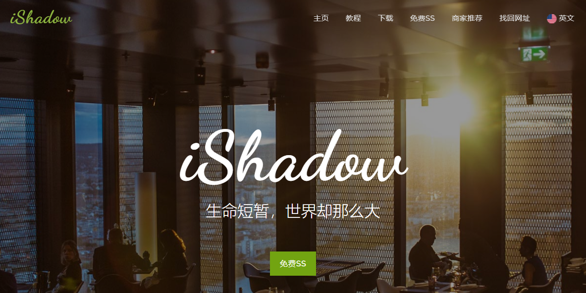

## 快速搭建vpn教程



### 前言

>作为一名技术男，总是去网上买vpn账号来翻墙，还是会有些脸红。我也是小白一枚，刚开始也是使用一些网站提供的免费vpn账号来翻墙（网上账号太贵）。后面在了解了翻墙的原理之后，打算自己搭建vpn

###准备
1. 自行了解`vps`的概念以及作用;
2. 购买一个国外vps


###开始
步骤1.
>购买一个国外vps！要求预装linux系统，同时拿到服务器的主机，用户名，密码。例如：
```
主机：155.94.235.113
用户名：root
密码：xddf12343
```
>
>下面列出几个博主目前用过性价比较高（其实就是便宜）的国外的vps，下行速度有点慢（毕竟便宜）：
>
>1.https://virmach.com/
>
>2.http://www.vpsdx.com/3964.html
>
>注意：国外vpn最好选择洛杉矶的，速度应该是最快的。

步骤2.
>连接服务器
>
>这里博主使用的是`Xbrowser 5`工具，安装及使用方法自行百度

使用界面截图：


步骤3.
>安装shadowsocks，配置账号
>
>A.具体安装方法请参考：https://github.com/shadowsocks/shadowsocks-libev
>
>B.配置：参考https://github.com/shadowsocks/shadowsocks/wiki/Configuration-via-Config-File
>
>C.启动，参考：https://github.com/shadowsocks/shadowsocks/wiki/Shadowsocks-%E4%BD%BF%E7%94%A8%E8%AF%B4%E6%98%8E

步骤4.
>使用ss或ssr客户端翻墙
>
>先下载客户端：https://github.com/shadowsocks/shadowsocks-windows/releases
>
>配置账号
>
>运行客户端，访问google


###总结


###附上免费的vpn翻墙网站
>1.[免费ss账号 - ishadow](https://global.ishadowx.net/index_cn.html)

>2.[吾爱ss](https://www.52ss.pl/)

注意：上面两个网站，第一个有很详细的教程，如何使用这里就不提了！第二个网站需要先注册一个账号，然后每天可领取流量，使用网站提供的免费节点。

###End